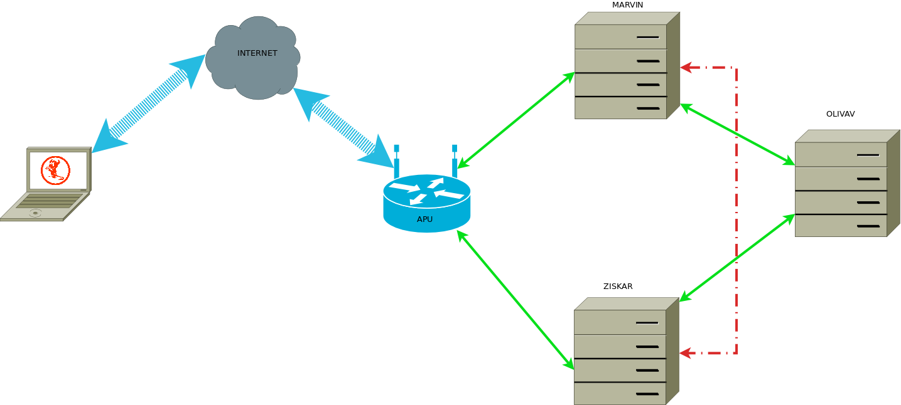

## APU

### Router System Configuration:
- Freebsd 12.1.5
- CBSD
- Reggae
- VPN

### Jails:
- CBSD

## Marvin
### Server Configuration:

- 8 CPU CORE
- 1.7Ghz AMD64
- 64 GB RAM

### System Configuration:

- [Freebsd 12.1.5](https://www.freebsd.org/)
- [CBSD](https://cbsd.io)
- [Reggae](https://cbsd.io/reggae/quick-start/)
- [Jail](https://www.freebsd.org/doc/handbook/jails.html)

### Jails:

- CBSD
- [NGINX](https://www.nginx.com/)
- [LETSENCRYPT](https://letsencrypt.org/)
- [BsidesNS.org](https://Bsidesns.org/)
- [PySer.org](https://pyser.org)
- [ZNC](https://wiki.znc.in/ZNC)
- [POLIPO](https://www.irif.fr/~jch/software/polipo/)

### Base:
- [PostgreSQL](https://www.postgresql.org/)(SLAVE)

## Ziskar
### Server Configuration:

- 8 CPU CORE
- 1.7Ghz AMD64
- 64 GB RAM

### System Configuration:

- Freebsd 12.1.5
- CBSD
- Reggae
- Jail

### Jails:

- CBSD
- NGINX
- LETSENCRYPT
- BsidesNS.org
- PySer.org
- [Jabber](https://www.jabber.org/)
- [LDAP](https://ldap.com/)
- [COTURN](https://github.com/coturn/coturn)

### Base:
- PostgreSQL (MASTER)

## OLIVAV
### Server Configuration:

- 2 CPU CORE XEON
- 3 Ghz AMD64
- 8 GB RAM

### System Configuration:

- Freebsd 12.1.5
- CBSD
- Reggae
- Jail

### Jails:

- CBSD

# DIAGRAM

